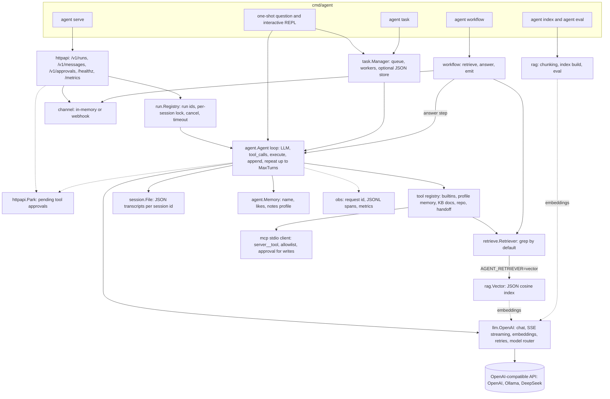

# agent_go

English | [简体中文](README.zh-CN.md)

[](https://github.com/AsaqeLee/agent_go/actions/workflows/ci.yml)
[](go.mod)
[](LICENSE)
[](https://github.com/AsaqeLee/agent_go/commits/main)

Pure Go **standard-library** AI agent runtime: readable, runnable, and embeddable. The core loop is intentional teaching material; RAG, MCP, HTTP, tracing, and handoff attach as adapters at existing seams—they do not live inside the loop.

> **Agent = LLM + Tools + Loop**  
> RAG / MCP / HTTP / task persistence are adapters.

Module path: `github.com/asaqelee/agent_go` (clone from `AsaqeLee/agent_go`).

## Table of contents

- [Features / scope](#features--scope)
- [Architecture](#architecture)
- [Requirements](#requirements)
- [Quick start](#quick-start)
- [HTTP API](#http-api)
- [Library usage](#library-usage)
- [Project layout](#project-layout)
- [Development](#development)
- [Status / limitations](#status--limitations)
- [License](#license)

## Features / scope

| Capability | Notes |
|------------|-------|
| Agent loop | `LLM → tool_calls → execute → append → LLM`, bounded by `MaxTurns` |
| Multi-turn sessions | History across `Run`; `Reset` / CLI `/new` |
| Tool-result truncation | Rune limit before history write (default 4096) |
| Trim + lossy summary | User-turn aware trim; bounded `[conversation_summary]` bullets |
| Trajectory folding | Keep full tool chains for the last N turns only |
| Structured memory | `name` / `likes` / `notes` via `profile_update`; disk + `[user_profile]` |
| Local knowledge base | `list_docs` / `search_docs` / `read_doc` with directory sandbox |
| Vector RAG | Chunking + `/v1/embeddings` (or offline hash) + JSON cosine index; `agent index` / `agent eval` |
| MCP | stdio JSON-RPC client; names `server__tool`; deny-by-default allowlist; write tools need approval |
| Streaming | OpenAI-compatible SSE; CLI tokens; `POST /v1/runs` with `stream:true` |
| Session store | Atomic JSON under `session.Store` |
| Async tasks | Queue + workers; `AGENT_TASK_STORE` JSON recovery |
| HTTP serve | `agent serve`: runs (sync/async/SSE), cancel, messages, `/healthz`, `/metrics` |
| Observability | Usage (incl. failed attempts), `X-Request-Id`, JSONL spans, `/metrics` |
| Handoff | `handoff` tool to specialists (default KB `docs`) |
| Plugin catalog | `agent.json` / `agent plugin list` |
| OpenAI-compatible APIs | Official API, Ollama, DeepSeek, etc. |
| Zero third-party deps | `net/http` + stdlib only |
| Parallel tools | Same-turn fan-out/join with ordered write-back |

## Architecture

How `cmd/agent` wires the packages together (one-shot / REPL, `agent serve`, and the `task`, `index`, `eval`, `workflow` subcommands):



The loop itself stays small; RAG, MCP, HTTP, tracing, and handoff attach through the `Retriever`, `Tool`, `OnEvent`, and `session.Store` seams. Details: [`docs/ARCHITECTURE.md`](docs/ARCHITECTURE.md).

## Requirements

- Go 1.22+
- An OpenAI-compatible API key (or local Ollama with function-calling support)

## Quick start

```bash
git clone https://github.com/AsaqeLee/agent_go.git
cd agent_go

cp .env.example .env
# edit OPENAI_API_KEY / OPENAI_MODEL, or export them

go run ./cmd/agent "What time is it? Use a tool."
go run ./cmd/agent                 # interactive
go run ./cmd/agent serve --addr :8080
go build -o bin/agent ./cmd/agent
```

Priority for configuration: **existing environment variables > `.env` > code defaults**.

### Knowledge base demo

```bash
export AGENT_DOCS_ROOT=examples/kb   # optional; auto-detected if present
go run ./cmd/agent "How many annual leave days after one year? Search the docs."
```

### MCP

Copy [`mcp.json.example`](mcp.json.example) to `mcp.json` (or set `mcp.servers` in `agent.json`). Default policy is deny. Write tools prompt in the CLI (`y/N`) or use `POST /v1/approvals/{id}` over HTTP. `AGENT_MCP_AUTO_APPROVE=true` skips approval (local only).

### Ollama

```bash
export OPENAI_BASE_URL=http://localhost:11434/v1
export OPENAI_API_KEY=ollama
export OPENAI_MODEL=qwen2.5:7b   # must support function calling
go run ./cmd/agent "Compute 12 * 34"
```

### Selected environment variables

| Variable | Default | Meaning |
|----------|---------|---------|
| `OPENAI_API_KEY` | _(empty)_ | API key |
| `OPENAI_BASE_URL` | `https://api.openai.com/v1` | Compatible base URL |
| `OPENAI_MODEL` | `gpt-4o-mini` | Chat model |
| `AGENT_DOCS_ROOT` | auto `examples/kb` | KB root |
| `AGENT_RETRIEVER` | `grep` | `grep` or `vector` |
| `AGENT_SESSION_DIR` | `.agent_sessions` | Session JSON dir; `off` disables |
| `AGENT_TASK_STORE` | `.agent_tasks.json` | Task persistence; `off` = memory |
| `AGENT_HTTP_ADDR` | `:8080` | `agent serve` listen address |
| `AGENT_MCP_CONFIG` | `mcp.json` if present | MCP servers |
| `AGENT_CONFIG` | `agent.json` if present | Plugin catalog |

See [`.env.example`](.env.example) for the full list.

## HTTP API

`agent serve` exposes the runtime over HTTP (routes from [`httpapi/server.go`](httpapi/server.go)):

| Method | Path | Purpose |
|--------|------|---------|
| `GET` | `/healthz` | Liveness plus session-dir check (never requires a token) |
| `GET` | `/metrics` | Plain-text counters (`agent_runs_started`, `agent_runs_succeeded`, ...) |
| `POST` | `/v1/runs` | Start a run: `{"input", "session_id", "stream", "wait"}` |
| `GET` | `/v1/runs/{id}` | Run status and output |
| `POST` | `/v1/runs/{id}/cancel` | Cancel a running run |
| `POST` | `/v1/approvals/{id}` | Approve or deny a parked write tool: `{"allow": true}` |
| `POST` | `/v1/messages` | IM-style entry: `{"text", "session_id", "user"}`; the reply is also sent to the channel |

When `AGENT_HTTP_TOKEN` is set, every route except `/healthz` requires `Authorization: Bearer <token>` or `X-Agent-Token: <token>`.

```bash
export OPENAI_API_KEY=sk-...          # or use the Ollama settings above
go run ./cmd/agent serve --addr :8080

# in another terminal
curl -s http://127.0.0.1:8080/healthz
# {"checks":{},"in_flight":0,"ok":true,"request_id":"8ad536f387abcd7a","uptime_s":2}

# synchronous run (wait defaults to true)
curl -s -X POST http://127.0.0.1:8080/v1/runs \
  -H 'Content-Type: application/json' \
  -d '{"input":"What time is it? Use a tool.","session_id":"demo"}'
# {"run_id":"r_...","request_id":"...","output":"...","session_id":"demo","status":"succeeded",
#  "usage":{"PromptTokens":...,"CompletionTokens":...,"TotalTokens":...,"Calls":...}}

# asynchronous run: 202 with status "running", then poll
curl -s -X POST http://127.0.0.1:8080/v1/runs \
  -H 'Content-Type: application/json' \
  -d '{"input":"Summarize the leave policy.","wait":false}'
curl -s http://127.0.0.1:8080/v1/runs/<run_id>

# Server-Sent Events: tool_start / tool_end / approval / error events, then a final "done" event
curl -N -s -X POST http://127.0.0.1:8080/v1/runs \
  -H 'Content-Type: application/json' \
  -d '{"input":"Compute 12 * 34","stream":true}'
```

A second run on a session that is already busy returns `409 Conflict`; a failed run returns `502` with the error in the `error` field.

## Library usage

```go
package main

import (
	"context"
	"fmt"
	"log"
	"os"

	"github.com/asaqelee/agent_go/agent"
	"github.com/asaqelee/agent_go/llm"
	"github.com/asaqelee/agent_go/tool"
)

func main() {
	mem := agent.NewMemory()
	a := &agent.Agent{
		Provider: llm.NewOpenAI("", os.Getenv("OPENAI_API_KEY"), "gpt-4o-mini"),
		Memory:   mem,
		Tools:    tool.DefaultTools(mem, "examples/kb"),
		MaxTurns: 8,
	}
	out, err := a.Run(context.Background(), "What time is it?")
	if err != nil {
		log.Fatal(err)
	}
	fmt.Println(out)
}
```

If you fork under another module path, update `go.mod` and imports accordingly.

## Project layout

```text
agent/      # loop, session policy, memory, handoff
llm/        # provider, streamer, embedder
tool/       # tool contract, builtins, KB
retrieve/   # Retriever + grep adapter
rag/        # chunking, vector index, eval
mcp/        # stdio MCP client
session/    # session store
task/       # async tasks
httpapi/    # HTTP API
run/        # run registry (ids, per-session lock, cancel)
obs/        # request ids, JSONL spans, metrics
channel/    # IM message entry / exit (memory, webhook)
plugin/     # agent.json catalog
workflow/   # fixed retrieve → answer → emit DAG
cmd/agent/  # CLI
examples/
docs/
```

## Development

```bash
go test ./...
go test -race ./...   # also run in CI
go vet ./...
go build -o bin/agent ./cmd/agent
```

CI ([`.github/workflows/ci.yml`](.github/workflows/ci.yml)) runs vet, tests, race-enabled tests, and builds on Go 1.22, 1.23, and 1.24.

Suggested source reading order: `llm/types.go` → `tool/tool.go` → `agent/agent.go` → MCP/RAG adapters → `httpapi` → `cmd/agent`. See [`docs/ARCHITECTURE.md`](docs/ARCHITECTURE.md) and [`docs/LEARNING.md`](docs/LEARNING.md).

## Status / limitations

Educational / experimental runtime. Deliberately **not** multi-instance HA, full IM platform integration, or Kafka. Single-process implementations prove the seams; production boundaries and troubleshooting notes live in [`docs/PRODUCTION.md`](docs/PRODUCTION.md).

## License

MIT. See [LICENSE](LICENSE).
