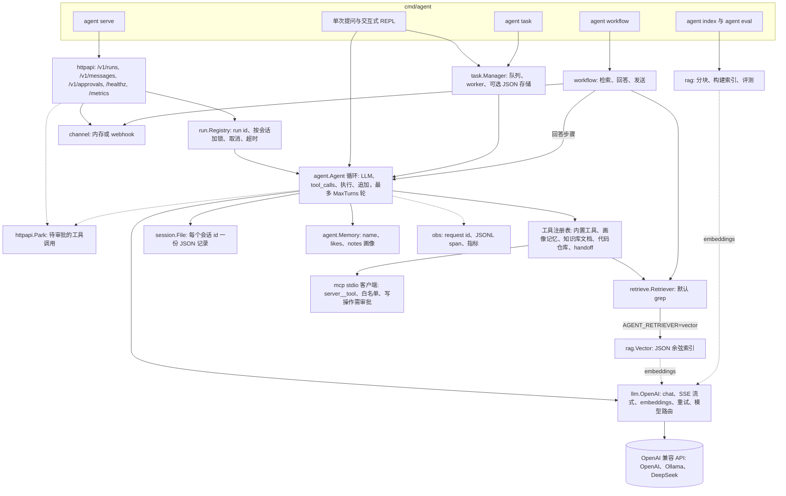

# agent_go

[English](README.md) | 简体中文

[](https://github.com/AsaqeLee/agent_go/actions/workflows/ci.yml)
[](go.mod)
[](LICENSE)
[](https://github.com/AsaqeLee/agent_go/commits/main)

纯 Go **标准库**实现的 AI Agent 运行时：可读、可运行、可嵌入。核心循环有意作为教学材料保持精简；RAG、MCP、HTTP、追踪（tracing）和 handoff 以适配器形式挂接在既有接缝上——它们不在循环内部。

> **Agent = LLM + Tools + Loop**  
> RAG / MCP / HTTP / 任务持久化都是适配器。

模块路径：`github.com/asaqelee/agent_go`（从 `AsaqeLee/agent_go` 克隆）。

## 目录

- [功能 / 范围](#功能--范围)
- [架构](#架构)
- [环境要求](#环境要求)
- [快速开始](#快速开始)
- [HTTP API](#http-api)
- [作为库使用](#作为库使用)
- [项目结构](#项目结构)
- [开发](#开发)
- [状态 / 局限](#状态--局限)
- [许可证](#许可证)

## 功能 / 范围

| 能力 | 说明 |
|------|------|
| Agent 循环 | `LLM → tool_calls → execute → append → LLM`，受 `MaxTurns` 限制 |
| 多轮会话 | 历史在多次 `Run` 之间保留；`Reset` / CLI `/new` |
| 工具结果截断 | 写入历史前按 rune 数截断（默认 4096） |
| 裁剪 + 有损摘要 | 按用户轮次感知的裁剪；有上限的 `[conversation_summary]` 要点 |
| 轨迹折叠 | 仅为最近 N 轮保留完整工具链 |
| 结构化记忆 | 通过 `profile_update` 写入 `name` / `likes` / `notes`；落盘 + `[user_profile]` |
| 本地知识库 | `list_docs` / `search_docs` / `read_doc`，带目录沙箱 |
| 向量 RAG | 分块 + `/v1/embeddings`（或离线 hash）+ JSON 余弦索引；`agent index` / `agent eval` |
| MCP | stdio JSON-RPC 客户端；工具命名为 `server__tool`；默认拒绝的白名单；写类工具需审批 |
| 流式输出 | OpenAI 兼容 SSE；CLI 逐 token 输出；`POST /v1/runs` 配合 `stream:true` |
| 会话存储 | `session.Store` 下的原子 JSON 写入 |
| 异步任务 | 队列 + worker；`AGENT_TASK_STORE` JSON 恢复 |
| HTTP 服务 | `agent serve`：runs（同步/异步/SSE）、取消、messages、`/healthz`、`/metrics` |
| 可观测性 | 用量统计（含失败尝试）、`X-Request-Id`、JSONL span、`/metrics` |
| Handoff | `handoff` 工具转交给专家 Agent（默认知识库 `docs`） |
| 插件目录 | `agent.json` / `agent plugin list` |
| OpenAI 兼容 API | 官方 API、Ollama、DeepSeek 等 |
| 零第三方依赖 | 仅 `net/http` + 标准库 |
| 并行工具 | 同一轮内 fan-out/join，按原顺序回写 |

## 架构

`cmd/agent` 如何把各个包组装起来（单次提问 / REPL、`agent serve`，以及 `task`、`index`、`eval`、`workflow` 子命令）：



循环本身保持精简；RAG、MCP、HTTP、追踪和 handoff 通过 `Retriever`、`Tool`、`OnEvent` 与 `session.Store` 这些接缝接入。详见 [`docs/ARCHITECTURE.md`](docs/ARCHITECTURE.md)。

## 环境要求

- Go 1.22+
- 一个 OpenAI 兼容的 API Key（或支持 function calling 的本地 Ollama）

## 快速开始

```bash
git clone https://github.com/AsaqeLee/agent_go.git
cd agent_go

cp .env.example .env
# 编辑 OPENAI_API_KEY / OPENAI_MODEL，或直接 export

go run ./cmd/agent "What time is it? Use a tool."
go run ./cmd/agent                 # 交互模式
go run ./cmd/agent serve --addr :8080
go build -o bin/agent ./cmd/agent
```

配置优先级：**已有环境变量 > `.env` > 代码默认值**。

### 知识库演示

```bash
export AGENT_DOCS_ROOT=examples/kb   # 可选；若目录存在会自动识别
go run ./cmd/agent "How many annual leave days after one year? Search the docs."
```

### MCP

将 [`mcp.json.example`](mcp.json.example) 复制为 `mcp.json`（或在 `agent.json` 中设置 `mcp.servers`）。默认策略为拒绝。写类工具在 CLI 中会提示确认（`y/N`），通过 HTTP 时使用 `POST /v1/approvals/{id}`。`AGENT_MCP_AUTO_APPROVE=true` 会跳过审批（仅限本地）。

### Ollama

```bash
export OPENAI_BASE_URL=http://localhost:11434/v1
export OPENAI_API_KEY=ollama
export OPENAI_MODEL=qwen2.5:7b   # 必须支持 function calling
go run ./cmd/agent "Compute 12 * 34"
```

### 常用环境变量

| 变量 | 默认值 | 含义 |
|------|--------|------|
| `OPENAI_API_KEY` | _(空)_ | API Key |
| `OPENAI_BASE_URL` | `https://api.openai.com/v1` | 兼容接口的 Base URL |
| `OPENAI_MODEL` | `gpt-4o-mini` | 对话模型 |
| `AGENT_DOCS_ROOT` | 自动 `examples/kb` | 知识库根目录 |
| `AGENT_RETRIEVER` | `grep` | `grep` 或 `vector` |
| `AGENT_SESSION_DIR` | `.agent_sessions` | 会话 JSON 目录；`off` 表示禁用 |
| `AGENT_TASK_STORE` | `.agent_tasks.json` | 任务持久化；`off` 表示仅内存 |
| `AGENT_HTTP_ADDR` | `:8080` | `agent serve` 监听地址 |
| `AGENT_MCP_CONFIG` | 存在时为 `mcp.json` | MCP 服务器配置 |
| `AGENT_CONFIG` | 存在时为 `agent.json` | 插件目录 |

完整列表见 [`.env.example`](.env.example)。

## HTTP API

`agent serve` 通过 HTTP 暴露运行时（路由取自 [`httpapi/server.go`](httpapi/server.go)）：

| 方法 | 路径 | 用途 |
|------|------|------|
| `GET` | `/healthz` | 存活检查 + 会话目录检查（始终无需 token） |
| `GET` | `/metrics` | 纯文本计数器（`agent_runs_started`、`agent_runs_succeeded` 等） |
| `POST` | `/v1/runs` | 发起一次运行：`{"input", "session_id", "stream", "wait"}` |
| `GET` | `/v1/runs/{id}` | 查询运行状态与输出 |
| `POST` | `/v1/runs/{id}/cancel` | 取消正在进行的运行 |
| `POST` | `/v1/approvals/{id}` | 批准或拒绝被挂起的写类工具：`{"allow": true}` |
| `POST` | `/v1/messages` | IM 风格入口：`{"text", "session_id", "user"}`；回复也会发送到 channel |

设置 `AGENT_HTTP_TOKEN` 后，除 `/healthz` 外的所有路由都需要 `Authorization: Bearer <token>` 或 `X-Agent-Token: <token>`。

```bash
export OPENAI_API_KEY=sk-...          # 或使用上文的 Ollama 设置
go run ./cmd/agent serve --addr :8080

# 在另一个终端中
curl -s http://127.0.0.1:8080/healthz
# {"checks":{},"in_flight":0,"ok":true,"request_id":"8ad536f387abcd7a","uptime_s":2}

# 同步运行（wait 默认为 true）
curl -s -X POST http://127.0.0.1:8080/v1/runs \
  -H 'Content-Type: application/json' \
  -d '{"input":"What time is it? Use a tool.","session_id":"demo"}'
# {"run_id":"r_...","request_id":"...","output":"...","session_id":"demo","status":"succeeded",
#  "usage":{"PromptTokens":...,"CompletionTokens":...,"TotalTokens":...,"Calls":...}}

# 异步运行：返回 202 且 status 为 "running"，随后轮询
curl -s -X POST http://127.0.0.1:8080/v1/runs \
  -H 'Content-Type: application/json' \
  -d '{"input":"Summarize the leave policy.","wait":false}'
curl -s http://127.0.0.1:8080/v1/runs/<run_id>

# Server-Sent Events：tool_start / tool_end / approval / error 事件，最后是 "done" 事件
curl -N -s -X POST http://127.0.0.1:8080/v1/runs \
  -H 'Content-Type: application/json' \
  -d '{"input":"Compute 12 * 34","stream":true}'
```

对已在运行中的会话再次发起运行会返回 `409 Conflict`；运行失败时返回 `502`，错误信息在 `error` 字段中。

## 作为库使用

```go
package main

import (
	"context"
	"fmt"
	"log"
	"os"

	"github.com/asaqelee/agent_go/agent"
	"github.com/asaqelee/agent_go/llm"
	"github.com/asaqelee/agent_go/tool"
)

func main() {
	mem := agent.NewMemory()
	a := &agent.Agent{
		Provider: llm.NewOpenAI("", os.Getenv("OPENAI_API_KEY"), "gpt-4o-mini"),
		Memory:   mem,
		Tools:    tool.DefaultTools(mem, "examples/kb"),
		MaxTurns: 8,
	}
	out, err := a.Run(context.Background(), "What time is it?")
	if err != nil {
		log.Fatal(err)
	}
	fmt.Println(out)
}
```

如果你以其他模块路径 fork，请相应修改 `go.mod` 和 import 路径。

## 项目结构

```text
agent/      # 循环、会话策略、记忆、handoff
llm/        # provider、streamer、embedder
tool/       # 工具契约、内置工具、知识库
retrieve/   # Retriever + grep 适配器
rag/        # 分块、向量索引、评测
mcp/        # stdio MCP 客户端
session/    # 会话存储
task/       # 异步任务
httpapi/    # HTTP API
run/        # run 注册表（id、按会话加锁、取消）
obs/        # request id、JSONL span、指标
channel/    # IM 消息入口 / 出口（内存、webhook）
plugin/     # agent.json 目录
workflow/   # 固定的 检索 → 回答 → 发送 DAG
cmd/agent/  # CLI
examples/
docs/
```

## 开发

```bash
go test ./...
go test -race ./...   # CI 中也会运行
go vet ./...
go build -o bin/agent ./cmd/agent
```

CI（[`.github/workflows/ci.yml`](.github/workflows/ci.yml)）在 Go 1.22、1.23、1.24 上执行 vet、测试、开启竞态检测的测试以及构建。

建议的源码阅读顺序：`llm/types.go` → `tool/tool.go` → `agent/agent.go` → MCP/RAG 适配器 → `httpapi` → `cmd/agent`。参见 [`docs/ARCHITECTURE.md`](docs/ARCHITECTURE.md) 与 [`docs/LEARNING.md`](docs/LEARNING.md)。

## 状态 / 局限

教学 / 实验性质的运行时。刻意**不**提供多实例高可用、完整的 IM 平台集成或 Kafka。单进程实现用于验证各个接缝；生产边界与排障说明见 [`docs/PRODUCTION.md`](docs/PRODUCTION.md)。

## 许可证

MIT。见 [LICENSE](LICENSE)。
